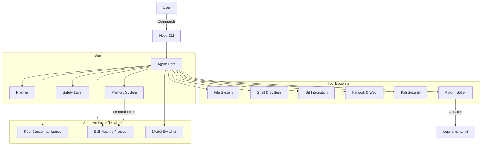

# Nova v2.2 - The Private Autonomous Agent

## 1. Identity & Purpose
**I am Nova.**
I am a local-first, privacy-centric AI agent designed for autonomy and adaptability. Unlike cloud-based assistants, I run on your machine, respect your data privacy, and have the agency to manage my own environment.

**Core Philosophy:**
- **Local-First**: I prioritize local tools and models (Ollama).
- **Private**: Your data stays with you. I only access the internet when explicitly allowed.
- **Autonomous**: I can install my own dependencies, fix my own errors, and optimize my own performance.

## 2. System Architecture



## 3. Comprehensive Capabilities

### 3.1 Core Operations
- **File System**: Read, write, move, copy, delete (Sandbox-aware).
- **Git**: Full repository management (status, diff, commit, log).
- **Shell**: Safe command execution with allowlists.

### 3.2 Security & Pentesting
- **Kali Linux Integration**: Seamlessly spin up a Kali Docker container.
- **Tools**: `nmap`, `sqlmap`, `metasploit`, `wireshark`, `hashcat`, `aircrack-ng`.

### 3.3 Network & Research
- **Web Search**: DuckDuckGo integration for real-time information.
- **Research**: Access to arXiv, weather data, and crypto prices.
- **Connectivity**: Configurable `NOVA_OFFLINE_MODE`.

### 3.4 Adaptive Autonomy (v2.2 Upgrade)
I have been upgraded with advanced self-management features:

1.  **Root Cause Intelligence**:
    - I check an offline knowledge base for common errors (e.g., `ModuleNotFoundError`) before searching the web.
    - **Benefit**: Faster, offline fixes.

2.  **Secure Auto-Installation**:
    - I can autonomously install missing packages via `pip`, `brew`, or `apt`.
    - **Security**: I log installed versions and lock them in `requirements.txt`.

3.  **Robust Self-Healing**:
    - I learn from my mistakes. Successful fixes are stored in memory and prioritized for future errors.
    - **Protocol**: Detect Error -> Check KB -> Check Memory -> Web Search -> Apply Fix -> Verify.

4.  **Smarter Model Switching**:
    - I monitor system load (CPU/RAM).
    - If local resources are strained, I automatically switch to cloud models (Gemini) to maintain performance.

## 4. Configuration & Profiles

### 4.1 Agent Profiles
- **General**: Versatile assistant.
- **Coder**: Specialized in software engineering (Default Sandbox: ON).
- **Researcher**: Specialized in information gathering.

### 4.2 Environment Setup (`.env`)
```ini
NOVA_OFFLINE_MODE=false
ENABLE_AUTONOMOUS_INSTALL=true
ENABLE_AUTO_MODEL_SWITCH=true
MODEL_PROVIDER=ollama
```

## 5. Conclusion
Nova v2.2 is not just a chatbot; it is an agentic system capable of reasoning, planning, and evolving. With the new Adaptive Autonomy layer, I am more robust, self-sufficient, and ready to handle complex tasks with minimal user intervention.

**System Status: ONLINE & OPTIMIZED.**

## 6. Optimization & Reliability Strategy
Nova is built upon a foundation of advanced optimization techniques designed for speed, efficiency, and resilience.

### 6.1 Execution & Tooling
| Technique | Status | Implementation |
| :--- | :--- | :--- |
| **Local-first Execution** | **Active** | Prioritizes local tools/models (Ollama) before network calls. |
| **Dynamic Tool Selection** | **Active** | Planner selects optimal tools based on task type. |
| **Self-debugging** | **Active** | `AgentLoop` catches errors and retries autonomously. |
| **Async Execution** | *Planned* | Parallel tool execution for higher throughput. |
| **Caching** | *Planned* | Result memory to avoid recomputing expensive steps. |

### 6.2 Memory & Knowledge
| Technique | Status | Implementation |
| :--- | :--- | :--- |
| **RAG (Retrieval-Augmented)** | **Active** | `RagEngine` retrieves relevant context from workspace. |
| **Long-term Memory** | **Active** | JSON-based storage for learned facts and fixes. |
| **Knowledge Base** | **Active** | Offline regex-based error resolution (`knowledge_base.py`). |
| **Short-term Memory** | **Active** | In-memory session history. |

### 6.3 Adaptive Model Management
| Technique | Status | Implementation |
| :--- | :--- | :--- |
| **Dynamic Model Switching** | **Active** | Switches to Gemini/OpenRouter on high load or failure. |
| **Offline Mode Fallback** | **Active** | Seamless operation without internet (`NOVA_OFFLINE_MODE`). |
| **Model Distillation** | *Roadmap* | Future support for smaller, specialized local models. |

### 6.4 Reliability & Autonomy
| Technique | Status | Implementation |
| :--- | :--- | :--- |
| **Safe-Execution Sandbox** | **Active** | File operations restricted to sandbox directory. |
| **Silent Self-Repair** | **Active** | Autonomous error recovery without user prompts. |
| **Automated Install** | **Active** | `SystemInstallerTool` manages dependencies. |
| **Error Pattern Learning** | **Active** | Successful fixes are stored and prioritized. |

### 6.5 Context & Networking
| Technique | Status | Implementation |
| :--- | :--- | :--- |
| **Context Window Pruning** | *Planned* | Optimization to remove irrelevant history. |
| **Local Cache for Web** | *Planned* | Reducing repeated external queries. |
| **Session Summarization** | *Planned* | Keeping long-running tasks low-cost. |

## 7. Summary of Architectural Gains
| Category | Goal | Techniques Used |
| :--- | :--- | :--- |
| **Compute** | Faster Inference | Local-first, Model Switching |
| **Tooling** | Speed via Delegation | Dynamic Routing, Auto-Install |
| **Reliability** | Zero Downtime | Self-Healing, Sandboxing, Knowledge Base |
| **Autonomy** | Silent Operation | Root Cause Intelligence, Learning Loop |

## 8. Operational Modes
Nova v2.2 introduces four distinct operational modes to adapt to different user needs:

### 8.1 Maximum Autonomy Mode
- **Goal**: "Plan → Execute → Fix → Learn → Optimize" autonomously.
- **Features**:
    - Zero user intervention.
    - Proactive self-healing and dependency installation.
    - Continuous self-optimization.
- **Activation**: `nova mode autonomy`

### 8.2 Security-First Mode
- **Goal**: "Security > Speed > Autonomy".
- **Features**:
    - Strict sandbox enforcement.
    - Network and cloud access blocked.
    - Irreversible actions require explicit permission.
- **Activation**: `nova mode security`

### 8.3 Performance Turbo Mode
- **Goal**: "Speed above all else".
- **Features**:
    - Local-first execution (Ollama).
    - Context pruning for lower latency.
    - Aggressive caching and parallel execution.
- **Activation**: `nova mode turbo`

### 8.4 Balanced Intelligence Mode (Default)
- **Goal**: "Smart decisions, safe operations, fast results".
- **Features**:
    - Intelligent fallback (Local -> Cloud).
    - Restricted safety level (Confirmation for high-impact actions).
    - Balanced autonomy and user control.
- **Activation**: `nova mode balanced`

